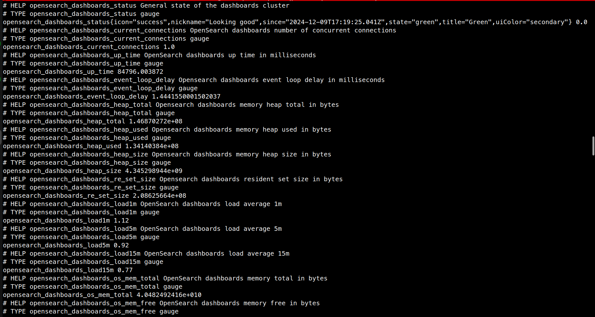

# Prometheus Opensearch Dashboards Exporter
An exporter for OpenSearch Dashboards


## Installing
With [poetry](https://python-poetry.org/) installed, clone this repo and run:

```shell
poetry install
```

```shell
poetry build
```

Builds will be located at `dist`. Access the virtual environment and install the build package.

```shell
poetry shell

pip install ./dist/prometheus_opensearch_dashboards_exporter-0.1.0.tar.gz
```


## Running
Identify the url of the `opensearch-dashboards` that you want to monitor, set the `OPENSEARCH_DASHBOARDS_USER` and `OPENSEARCH_DASHBOARDS_PASSWORD` and start the Prometheus exporter:

```shell
export OPENSEARCH_DASHBOARDS_USER="my-user"
export OPENSEARCH_DASHBOARDS_PASSWORD="my-pass"
prometheus-opensearch-dashboards-exporter  --url=http(s)://<IP>:5601
```

After that, it's possible to check the metrics:
```
 curl http://localhost:9684/metrics
```




By default the server will start at localhost on port `9684`, but it's possible to choose a different one using the `--port` flag. E.g:

```shell
prometheus-opensearch-dashboards-exporter --url http(s)://<IP>:5601 --port 9685
```


## Metrics

The metrics exposed by this Exporter are the following.

| Metric                                         | Description                                                                                                                                | Type  |
| -----------------------------------------------| ------------------------------------------------------------------------------------------------------------------------------------------ | ----- |
| `opensearch_dashboards_status`                 | Overall status. Values `0`, `1`, `2`, `-1` are for Green, Yellow, Red and Unknown, respectively. See the meaning of each color at the [docs](https://opensearch.org/docs/1.2/opensearch/rest-api/cluster-health/)                                 | Gauge |
| `opensearch_dashboards_statuses`               | Granular status of plugins and core components. Values `0`, `1`, `2`, `-1` are for Green, Yellow, Red and Unknown, respectively | Gauge |
| `opensearch_dashboards_concurrent_connections` | Concurrent connections                                                                                                          | Gauge |
| `opensearch_dashboards_up_time`                | Uptime in milliseconds                                                                                                          | Gauge |
| `opensearch_dashboards_event_loop_delay`       | NodeJS Event Loop Delay in Milli Seconds                                                                                        | Gauge |
| `opensearch_dashboards_heap_total`             | Heap total used in bytes                                                                                                        | Gauge |
| `opensearch_dashboards_heap_used`              | Heap used in bytes                                                                                                              | Gauge |
| `opensearch_dashboards_heap_size`              | Heap size limit in bytes                                                                                                        | Gauge |
| `opensearch_dashboards_re_set_size`            | Resident Set Size in bytes                                                                                                      | Gauge |
| `opensearch_dashboards_load_1m`                | Load average 1m                                                                                                                 | Gauge |
| `opensearch_dashboards_load_5m`                | Load average 5m                                                                                                                 | Gauge |
| `opensearch_dashboards_load_15m`               | Load average 15m                                                                                                                | Gauge |
| `opensearch_dashboards_os_mem_total`           | OS memory total in bytes                                                                                                        | Gauge |
| `opensearch_dashboards_os_mem_free`            | OS memory free in bytes                                                                                                         | Gauge |
| `opensearch_dashboards_os_mem_used`            | OS memory used in bytes                                                                                                         | Gauge |
| `opensearch_dashboards_resp_time_avg`          | Average response time in milliseconds                                                                                           | Gauge |
| `opensearch_dashboards_resp_time_max`          | Maximum response time in milliseconds                                                                                           | Gauge |
| `opensearch_dashboards_req_disconnects`        | Request disconnections count                                                                                                    | Gauge |
| `opensearch_dashboards_req_total`              | Total request count                                                                                                             | Gauge |
